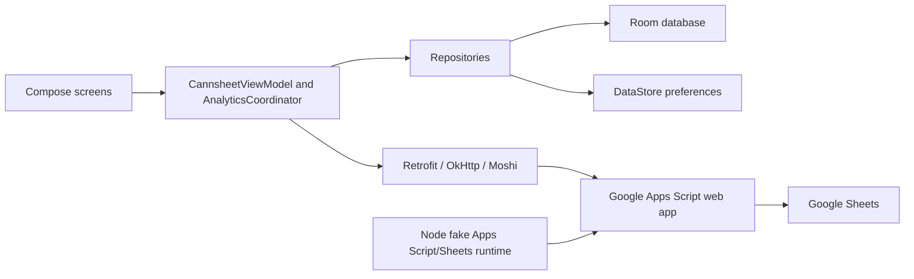

# Architecture

## System overview

Cannsheet Mobile is a single-module Android client backed by a Google Apps
Script web app and Google Sheets. The Android client is local-first for
user-created purchase, consumption, and finish actions: Room holds pending work
until the client acknowledgement logic accepts a compatible backend response.



## Android components

- `app/src/main/java/com/example/MainActivity.kt` starts the Compose application.
- `app/src/main/java/com/example/ui/AppNavigation.kt` owns the bottom navigation
  between Log, Purchase, Insights, and Settings.
- The screen files under `app/src/main/java/com/example/ui` render Compose UI
  and delegate operations to `CannsheetViewModel`.
- `app/src/main/java/com/example/ui/CannsheetViewModel.kt` coordinates product
  refresh, the cancellable submission countdown, queue snapshots, network calls,
  environment checks, acknowledgements, and user-visible sync state.
- `app/src/main/java/com/example/ui/AnalyticsState.kt` separates
  Insights/History loading, refresh, pagination, cache fallback, and UI error
  mapping.
- `app/src/main/java/com/example/data/Repository.kt` mediates Room operations
  and coordinates product refresh.
- `app/src/main/java/com/example/data/Database.kt` defines the Room schema, DAO,
  transactions, and migrations. The checked-in schema version is 8, with
  explicit migrations 2-to-3 through 7-to-8.
- `app/src/main/java/com/example/data/Network.kt` defines Apps Script
  request/response DTOs and Retrofit endpoints.
- `app/src/main/java/com/example/data/SyncQueueLogic.kt` decides which immutable
  queue IDs a response safely acknowledges.
- `app/src/main/java/com/example/data/AnalyticsData.kt` defines the versioned
  analytics/history contract, repository, and cache serialization.
- `app/src/main/java/com/example/data/ConsumptionPreferencesRepository.kt`
  stores quick-log presets and the unopened-product preference in DataStore.

## Important data flows

### Product refresh

1. The view model calls the Apps Script GET endpoint.
2. The response environment must match `BuildConfig.APP_ENVIRONMENT`.
3. Network products are mapped to Room entities.
4. A Room transaction replaces server-backed products, restores pending
   purchase products, reapplies queued finish state, and merges newer product
   interaction data.

### Purchase, consumption, and finish synchronization

1. A UI action enters a short cancellation countdown.
2. After confirmation, the action is written to a Room queue with a stable
   action/event UUID. Consumption and finish transactions also update local
   product state.
3. Synchronization snapshots the pending queues and uses a persisted request ID.
4. The snapshot is posted to Apps Script.
5. The client checks the response environment and request identity.
6. Only items acknowledged with an accepted `committed` or `duplicate` status,
   or covered by the explicit legacy-compatible rule, are deleted locally.
7. Timeouts and uncertain responses leave the items queued for safe retry.

### Insights and History

1. `AnalyticsCoordinator` requests versioned Insights or paginated History data.
2. The backend response must match the expected environment and contract.
3. Valid responses are cached in Room.
4. Cached data can be shown when a refresh fails.
5. History uses cursor pagination and permits a bounded stale-cursor recovery
   rather than mixing incompatible pages.

## Persistence and models

Room contains tables for products, purchase actions, consumption actions, finish
actions, product interactions, sync request state, and analytics cache entries.
DataStore holds user preferences that do not require relational transactions.

Room and the pending queues are user-data boundaries. Migrations must be
forward-only and tested; destructive fallback is not an acceptable shortcut.
Stable IDs and acknowledgement semantics must be preserved.

## Backend and external integrations

- `backend_additions.gs` is the Apps Script web-app implementation.
- `appsscript.json` enables the Advanced Sheets service, uses the V8 runtime,
  executes as the deploying user, and declares anonymous web-app access.
- No user authentication flow is present in the checked-in Android source. The
  client contract instead uses the configured endpoint, environment identifier,
  request IDs, immutable action/event IDs, response validation, and backend
  spreadsheet rules.
- Production and sandbox endpoints/build environments must remain isolated.
- Apps Script reads and writes the connected Google Sheets workbook. Backend
  changes must account for locking, retries, partial writes, duplicate delivery,
  reconciliation, and trigger behavior.

## State and error handling

Compose observes `StateFlow`/Flow state from the view model, analytics
coordinator, Room, and DataStore. Network and contract failures are translated
into user-visible status/error state. Pending work remains local when the server
cannot prove a safe acknowledgement. Analytics can fall back to cached data;
data-quality warnings remain explicit rather than silently normalizing unknown
source values.

## Testing approach

- `app/src/test`: JVM unit tests for UI helpers/coordinators, environment
  contracts, queue acknowledgement logic, preferences, filtering, and status
  handling.
- `app/src/androidTest`: Room migration/queue tests and Compose UI tests that
  require a device or emulator.
- `tests`: Node scripts execute the checked-in Apps Script source against fake
  Apps Script/Sheets implementations; a Python unittest covers deterministic
  backend benchmark tooling.
- `.github/workflows/android-pr-checks.yml`: Android unit tests, backend
  analytics tests, and a debug build for pull requests to `main`.

Tests that use fake runtimes do not prove the current state of a live Apps
Script deployment or spreadsheet.

## Build, deployment, and distribution

The default debug/release variants use the production endpoint and environment
values from `app/build.gradle.kts`; the sandbox variant uses an application ID
suffix and an untracked `sandbox.properties` endpoint. Release signing is
configured only when all required signing environment variables are present.

Pull requests target `main`. Tag pushes matching `v*` trigger the release
workflow, which validates the tag/version match, runs tests/lint, builds and
verifies a signed APK, creates a checksum, and publishes to a separate release
repository. That workflow is an explicit release operation, not ordinary
validation.

## Architectural boundaries

- UI code should not directly mutate Room or spreadsheet data.
- Repository/database operations own local persistence and transaction safety.
- Network DTOs and environment checks form a compatibility boundary.
- Pending queue rows are removed only through the acknowledgement rules.
- Android source, Apps Script source, live deployment state, spreadsheet state,
  CI state, and published APK state are separate evidence boundaries.

## Directory map

```text
app/src/main/                 Android production source and resources
app/src/sandbox/              Sandbox-specific resources
app/src/test/                 Local JVM tests
app/src/androidTest/          Device/emulator and Room migration tests
tests/                        Backend fake runtime and regression scripts
.github/workflows/            Pull-request and release automation
performance_evidence/         Checked-in backend performance evidence
docs/                         Shared project context and latest handoff
backend_additions.gs          Google Apps Script backend
appsscript.json               Apps Script manifest
```
