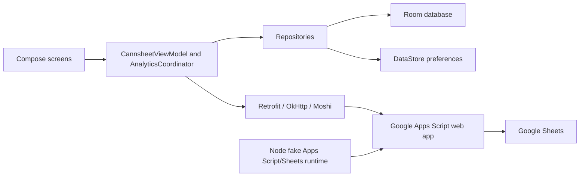
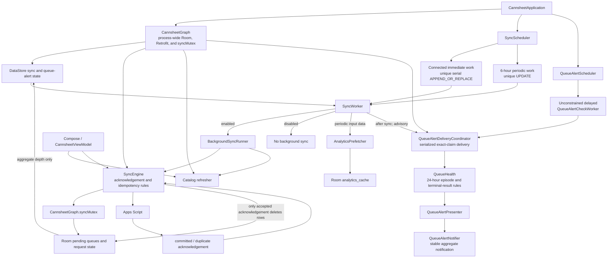
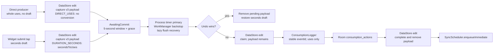

# Architecture

## System overview

Cannsheet Mobile is a single-module Android client backed by a Google Apps
Script web app and Google Sheets. The Android client is local-first for
user-created purchase, consumption, and finish actions: Room holds pending work
until the client acknowledgement logic accepts a compatible backend response.


```mermaid
flowchart LR
    UI["Compose screens"] --> VM["CannsheetViewModel and AnalyticsCoordinator"]
    VM --> Repo["Repositories"]
    Repo --> Room["Room database"]
    Repo --> Prefs["DataStore preferences"]
    VM --> HTTP["Retrofit / OkHttp / Moshi"]
    HTTP --> GAS["Google Apps Script web app"]
    GAS --> Sheets["Google Sheets"]
    Tests["Node fake Apps Script/Sheets runtime"] --> GAS
```

## Android components

- `app/src/main/java/com/example/CannsheetApplication.kt` performs process-wide
  dependency initialization and work scheduling. Its `CannsheetGraph` owns the
  one Room database, repositories, preferences, sync engine, catalog refresher,
  and the shared `syncMutex` that serializes every queue synchronization attempt.
  It also installs the widget implementation behind the data-facing
  `WidgetRefresher` interface and the notification implementation behind the
  data-facing `QueueAlertPresenter` interface; data and UI callers do not
  import widget or notification code.
- `app/src/main/java/com/example/MainActivity.kt` starts the Compose application.
- `app/src/main/java/com/example/ui/AppNavigation.kt` owns one navigation graph
  between Log, Purchase, Insights, and Settings, using a bottom bar at compact
  width and a rail at medium or expanded width.
- The screen files under `app/src/main/java/com/example/ui` render Compose UI
  and delegate operations to `CannsheetViewModel`.
- `app/src/main/java/com/example/ui/CannsheetViewModel.kt` coordinates product
  refresh, the cancellable submission countdown, queue snapshots, network calls,
  environment checks, acknowledgements, and user-visible sync state.
- `app/src/main/java/com/example/ui/AnalyticsState.kt` separates
  Insights/History loading, refresh, pagination, cache fallback, and UI error
  mapping.
- `app/src/main/java/com/example/data/Repository.kt` mediates Room operations
  and coordinates product refresh.
- `app/src/main/java/com/example/data/Database.kt` defines the Room schema, DAO,
  transactions, and migrations. The checked-in schema version is 11, with
  explicit migrations 2-to-3 through 9-to-10 and 10-to-11.
- `app/src/main/java/com/example/data/Network.kt` defines Apps Script
  request/response DTOs and Retrofit endpoints.
- `app/src/main/java/com/example/data/SyncQueueLogic.kt` decides which immutable
  queue IDs a response safely acknowledges.
- `app/src/main/java/com/example/data/AnalyticsData.kt` defines the versioned
  analytics/history contract, repository, and cache serialization.
- `app/src/main/java/com/example/data/ConsumptionPreferencesRepository.kt`
  stores global quick-log presets, per-product-type quick-log overrides,
  per-type seconds-per-use overrides, the loaded pen product ID, and the
  unopened-product preference in the `consumption_preferences` DataStore.
- `app/src/main/java/com/example/data/PurchaseDefaultsRepository.kt` stores
  the optional Purchase-screen defaults in a separate version-1 JSON
  Preferences DataStore. `CannsheetGraph` creates the one process-wide
  instance used by the view model.
- `app/src/main/java/com/example/widget` contains the API-24-compatible
  `AppWidgetProvider`/`RemoteViews` surfaces: the pen quick-log, multi-cart,
  sync-status, Today, and cache-only projection widgets. They reuse the loaded
  cart, rate, date, queue, local-history, and analytics-cache boundaries rather
  than introducing duplicate network contracts. The same package contains the
  `PenQuickTileService` Quick Settings entry point, which delegates to the
  existing pen draft, undo, durable queue, and sync path.
- `app/src/main/java/com/example/notifications` contains the Android channel,
  permission/availability, stable-card, and Settings-route intent details for
  queue alerts. It implements `QueueAlertPresenter`; queue-health and sync code
  depend only on that data-facing interface, just as widget refresh callers
  depend only on `WidgetRefresher`.
- `app/src/main/java/com/example/domain` contains the pen-state, quantity-unit,
  submit-time, out-of-app route, and inventory-runway helpers shared across
  presentation boundaries without creating UI/widget/notification cycles.

### Background queue synchronization

The app schedules safe retry of the existing pending queues without changing
their backend contract. `SyncEngine` is the only component allowed to send a
queue snapshot, and it holds `CannsheetGraph.syncMutex` for the complete
attempt. The foreground view model and the background worker therefore cannot
send competing snapshots from separate Room or Retrofit instances.


```mermaid
flowchart TD
    App["CannsheetApplication"] --> Graph["CannsheetGraph\nprocess-wide Room, Retrofit, and syncMutex"]
    Graph --> Prefs["DataStore sync and queue-alert state"]
    Graph --> Engine["SyncEngine\nacknowledgement and idempotency rules"]
    Graph --> Refresher["Catalog refresher"]
    Graph --> AlertDelivery["QueueAlertDeliveryCoordinator\nserialized exact-claim delivery"]
    App --> Scheduler["SyncScheduler"]
    App --> AlertScheduler["QueueAlertScheduler"]
    UI["Compose / CannsheetViewModel"] --> Refresher
    UI --> Engine
    Scheduler --> Immediate["Connected immediate work\nunique serial APPEND_OR_REPLACE"]
    Scheduler --> Periodic["6-hour periodic work\nunique UPDATE"]
    Immediate --> Worker["SyncWorker"]
    Periodic --> Worker
    Prefs --> Worker
    Worker -->|enabled| Runner["BackgroundSyncRunner"]
    Worker -->|disabled| Stop["No background sync"]
    Runner --> Engine
    Runner --> Refresher
    Engine --> Mutex["CannsheetGraph.syncMutex"]
    Mutex --> Queue["Room pending queues and request state"]
    Engine --> HTTP["Apps Script"]
    HTTP --> Ack["committed / duplicate acknowledgement"]
    Ack --> Engine
    Engine -->|only accepted acknowledgement deletes rows| Queue
    Worker -->|periodic input data| Prefetcher["AnalyticsPrefetcher"]
    Prefetcher --> Cache["Room analytics_cache"]
    Queue -->|aggregate depth only| Prefs
    Worker -->|after sync; advisory| AlertDelivery
    AlertScheduler --> AlertCheck["Unconstrained delayed\nQueueAlertCheckWorker"]
    AlertCheck --> AlertDelivery
    AlertDelivery --> Health["QueueHealth\n24-hour episode and terminal-result rules"]
    Health --> Presenter["QueueAlertPresenter"]
    Presenter --> Notifier["QueueAlertNotifier\nstable aggregate notification"]
```

`CannsheetApplication` keeps ordinary default WorkManager initialization; the
feature does not use expedited work. The scheduler enqueues connected immediate
work with `APPEND_OR_REPLACE` so requests remain serial, and updates the one
six-hour periodic work request with `UPDATE`. A DataStore preference is a kill
switch: when off, work exits without sending queued actions. It does not delete
queued rows or alter foreground acknowledgement behavior.

Queue alerts are an advisory side path. A serialized Room-depth observation
maintains one DataStore watermark for the current non-empty episode. Both sync
completion and a separate unconstrained delayed worker can evaluate the pure
queue-health rules, so a queue may cross the 24-hour threshold while network
work remains blocked. Presentation uses an exact persisted claim, one
process-wide delivery coordinator, and one stable notification ID. Failed
known posts release only their own claim. Evaluation reuses the DAO's aggregate
pending-action count, but no row payload or entry detail reaches the presenter;
alert delivery never writes, acknowledges, or deletes a queue row. The
background-sync kill switch and the separate opt-in alert preference both take
precedence.

## Important data flows

### Product refresh

1. The view model calls the Apps Script GET endpoint.
2. The response environment must match `BuildConfig.APP_ENVIRONMENT`.
3. Network products are mapped to Room entities.
4. A Room transaction replaces server-backed products, restores pending
   purchase products, reapplies queued finish state, and merges newer product
   interaction data. The nullable `totalUses` value is the backend-confirmed
   cumulative quantity from the correction-safe `Purchases.Uses` projection.

### Product usage totals on Log

The ordinary product GET response carries `totalUses` from the existing
`Purchases.Uses` projection. The backend validates that projection as finite and
nonnegative and rounds the response to six decimal places; it does not scan
`ConsumptionEvents` or calculate a second legacy total during catalog refresh.
Android stores the value as nullable `Product.totalUses` so older deployments and
products without a compatible confirmed value remain explicitly unavailable.

The Log screen keeps confirmed and local values separate. A Room query groups
durable, unsynced `consumption_actions` rows by `productId` and exposes their
`uses` sum as `pendingUsesByProduct`. Temporary borrowed-product IDs are remapped
by the existing acknowledgement transaction, so pending values follow the final
product ID. Acknowledgement deletes queue rows; the subsequent product refresh
supplies the new confirmed projection. Pending purchases, finish actions, the
undo countdown, and pending History corrections are not included in this sum.
The selected product card and Recent Products cards display both values when
available; the product picker does not. The app never adds pending values into
`totalUses` locally or presents a combined provisional total.

### Purchase, consumption, finish, and correction synchronization

1. A UI action enters a short cancellation countdown.
2. After confirmation, the action is written to a Room queue with a stable
   action/event UUID. Consumption corrections additionally retain the target
   event UUID, expected correction head, operation, and immutable replacement
   snapshot. Consumption and finish transactions also update local product
   state.
   Version-2 date/time strings represent wall-clock values in
   `CANN.TIME_ZONE`; the backend parses them explicitly in that zone so the
   stored instant cannot change with the Apps Script host or test-runner zone.
3. Synchronization snapshots the pending queues and uses a persisted request ID.
4. The snapshot is posted to Apps Script.
5. The client checks the response environment and request identity.
6. Only items acknowledged with an accepted `committed` or `duplicate` status,
   or covered by the explicit legacy-compatible rule, are deleted locally.
   Corrections require the exact sent action and target event pair.
7. Timeouts and uncertain responses leave the items queued for safe retry.

Background work follows the same flow, including the persisted request ID,
environment and response-identity checks, and acknowledgement-only deletion.
It is a second trigger for the existing idempotent protocol, not a new backend
write path or a second source of truth.

### Purchase autofill defaults

The Purchase screen requires a selected product type before it offers catalog
suggestions. Suggestions include all catalog statuses, are filtered by the
selected type, normalized for case-insensitive matching, de-duplicated by
normalized name, sorted deterministically, and limited to five entries. A
default is applied only after the user explicitly selects a suggestion; typing
the same name does not apply values.

Defaults use `trim().lowercase(Locale.ROOT)` product names and
`trim().uppercase(Locale.ROOT)` product types as their key. Saved values win
over catalog values, and THC is displayed as a percent while the DataStore and
queued purchase model use a canonical fraction. The switch is initially off
and saves only cost, THC, and grams when the confirmed purchase has been
written locally. The local Room queue write completes before the optional
DataStore write; a DataStore failure leaves the purchase queued and preserves
the previous defaults map.

### Quick-log quantity presets

The Settings screen keeps the existing global quick-log quantity editor and
stores those scalar values in the established `consumption_preferences`
DataStore keys. Per-product-type overrides are stored as one version-1 JSON
value in that same DataStore. A selected catalog product resolves its
normalized type through `ProductTypeKey`; a valid override supplies the Log
screen chips and default quantity, while a missing or invalid override falls
back to the global list. The Preferences repository reads both global values
and overrides from one `dataStore.data` snapshot so the view model does not
combine independent flows.

`ProductTypes` owns the canonical purchase-order codes and their labels while
also exposing normalized catalog extensions for the Settings picker. Borrowed
products intentionally keep the global presets: their free-text type is
collected after the quantity chips have already been rendered, so no reliable
type is available at chip-selection time. Overrides are keyed by type rather
than by individual product and do not change Room, the offline queues, or the
Apps Script contract.

Pen quick logging adds a second local preference map for seconds per use and a
single loaded-pen product ID. A missing seconds payload seeds `P` at 10 seconds
per use; an explicit versioned payload without `P` means the user turned that
rate off and must not be reseeded. The loaded cart resolves from an explicit
selectable `P` product first, then the most recently logged selectable `P`
product. The Log screen renders duration chips for that cart, but chip values
are converted back to uses before entering the existing submission countdown
and Room/offline queue. A successful local pen log moves the loaded-cart ID to
that product; finishing it clears the ID. No wire, Room, Apps Script, or
spreadsheet contract changes are involved.

### Home-screen pen widget

The pen quick-log widget is implemented with the platform `AppWidgetProvider`
and `RemoteViews` APIs, with no Glance dependency, so the same implementation
supports the project's minimum API 24 and is covered by the API 24 and API 36
validation paths. It displays the shared loaded-cart state and uses the same
`buildPenQuickLogState` rules as the Log screen:

- `Unavailable` has no usable loaded pen cart; `NoCart` has no selected or
  recently logged cart; `RateOff` requires Settings because a zero seconds-per-
  use rate cannot produce a safe quantity; `Composing` is the editable draft;
  and `AwaitingCommit` is the five-second undo window with a countdown.
- The draft starts at zero, changes in ten-second steps, and is clamped to
  0..600 seconds. Submit is enabled only for a positive draft; reset returns
  to zero and a counter tap returns to composing state.
- A submit broadcast performs one `DataStore.edit` that reads the current draft
  and captures payload version 3 with `inputKind = DURATION_SECONDS`: product,
  stable consumption `eventId`, submit and deadline timestamps, date, time,
  seconds, rate, and converted `uses`. Draft capture and payload construction
  are one atomic transaction.
- Version 3 also admits `inputKind = DIRECT_USES` for a producer that already
  knows a whole quantity and has no editable draft. A direct payload carries
  `uses` natively and leaves `seconds`, `secondsPerUse`, and
  `restoreDraftSeconds` null; it is staged through `submitDirectCommit`, which
  neither reads nor writes a draft key, and its Undo removes the payload without
  restoring a draft. Version 1 and version 2 payloads still decode and migrate
  deterministically to version 3.
- An undecodable pending value is preserved rather than overwritten, so
  future-version or corrupt state stays diagnosable instead of being silently
  discarded. Because it cannot be decoded it is reported as
  `pendingCommitUnreadable` and blocks both submission and draft editing for
  that surface, so the draft can never appear editable while every submit is
  refused.
- The displayed Undo window is five seconds, followed by 1.5 seconds of
  delivery grace. A serialized process-local timer is the primary delivery
  path; unique WorkManager work is the durable process-death backstop; lazy
  overdue flushing is the final recovery tier.
- Delivery claims the exact payload in DataStore without removing it, writes
  its stable event ID through `ConsumptionLogger`, and completes/removes the
  claim only after Room succeeds. A failure releases the claim for retry. A
  process owner plus unique claim token recovers process-death state without
  allowing an older attempt to complete a newer claim.
- Undo removes the pending payload only when its `commitId` still matches and
  the payload is unclaimed or its claim is stale; a live claim loses to the
  in-flight Room write. It restores the captured seconds draft only when that
  arbitration permits it. Timer/WorkManager cancellation is only an
  optimization; no widget path deletes an already queued Room row. Widget
  deletion force-commits a fresh payload before clearing per-widget UI state.

The deferred commit is represented by the following boundary sequence:


```mermaid
flowchart LR
    Tap["Widget submit tap\nseconds draft"] --> Capture["DataStore edit\ncapture v3 payload\nDURATION_SECONDS: secondsToUses"]
    Direct["Direct producer\nwhole uses, no draft"] --> Capture2["DataStore edit\ncapture v3 payload\nDIRECT_USES: no conversion"]
    Capture2 --> Window
    Capture --> Window["AwaitingCommit\n5-second window + grace"]
    Window --> Tiers["Process timer primary\nWorkManager backstop\nlazy flush recovery"]
    Tiers --> Decision{"Undo wins?"}
    Decision -->|yes| Restore["Remove pending payload\nrestore seconds draft"]
    Decision -->|no| Claim["DataStore edit\nclaim; payload remains"]
    Claim --> Logger["ConsumptionLogger\nstable eventId; uses only"]
    Logger --> Room["Room consumption_actions"]
    Room --> Complete["DataStore edit\ncomplete and remove payload"]
    Complete --> Sync["SyncScheduler.enqueueImmediate"]
```

Widget broadcasts and application startup lazily flush overdue pending
payloads. A ten-minute maximum pending age and backwards-clock recovery prevent
a wall-clock change from stranding the widget. A widget commit never re-points
the loaded cart at delayed write time. View-model pen-state changes,
acknowledged sync work, application startup, and provider actions request a
widget refresh through the `WidgetRefresher` boundary. Provider work is
serialized across mutation and render, and WorkManager joins the same
process-local `WidgetWorkSerializer`. That serializer orders the currently
known entry points; it does not protect future widget surfaces, another process,
or I/O moved outside the lock. The DataStore claim state is therefore the
correctness boundary for undo versus a live commit claim, while the mutex is an
ordering optimization.
The widget's local state remains usable when background sync
is disabled; the existing queue and acknowledgement rules continue to govern
delivery to Apps Script.

### Launcher, Quick Settings, and additional widget surfaces

Static launcher shortcuts for Log, Purchase, and Insights carry the existing
`EXTRA_START_ROUTE` contract into `MainActivity`; they do not create a second
navigation graph. `PenQuickTileService` uses the reserved tile key
`PEN_TILE_WIDGET_ID = Int.MAX_VALUE`, selects the first configured pen preset,
and reuses the same five-second undo, stable-event-ID, claim/write/complete, and
WorkManager backstop path as the pen widget. Tile labels and states are
presentation-only.

`SyncStatusWidgetProvider` reads only the aggregate pending-action count and
sync preference timestamps; its `Sync now` action enqueues the existing
`SyncScheduler` work and never receives queue rows or entry details.
`MultiCartWidgetProvider` presents up to four configured cart actions and
passes each selected quantity through the existing seconds-to-uses and deferred
queue path. `TodayWidgetProvider` reads the append-only local consumption
history table and derives its local-day total, average, comparison, and streak
without treating those figures as server-confirmed analytics.

`ProjectionWidgetProvider` is cache-only. It reads the cached
`InsightsResponseDto`, reuses the pure runway/spend presentation builders, and
renders the source snapshot's own as-of date next to every figure. It never
refreshes analytics, persists a projection, transmits a derived estimate, or
renders a figure when no snapshot exists. In-app projection suppression rules
remain stricter around stale, changing, or locally incomplete snapshots. A
durable Insights cache upsert requests a best-effort widget refresh afterward.
All five AppWidgetProvider surfaces use supported `RemoteViews` classes and
remain covered by the API 24 compatibility boundary.

### Insights and History

1. `AnalyticsCoordinator` requests versioned Insights or paginated History data.
2. The backend response must match the expected environment and contract.
3. Valid responses are cached in Room.
4. Cached data can be shown when a refresh fails.
5. History uses cursor pagination and permits a bounded stale-cursor recovery
   rather than mixing incompatible pages.
6. The periodic background worker can also warm the same Room cache. It reuses
   whichever Insights range or History filters the existing cache row was last
   generated for (falling back to the default range/unfiltered History when no
   cache exists yet) rather than resetting a user's last-viewed scope. This
   only changes the freshness of the first paint on a cold open; the
   coordinator still performs its own live refresh on first load or when the
   relevant state is stale from `onVisible` / `onHistoryVisible`.
7. The History detail sheet starts one refresh when an opened entry comes from
   a snapshot that cannot support a correction, and reports refresh progress or
   failure inline because the sheet covers the list notice. It tracks the open
   entry by event UUID, so a successful refresh re-binds the sheet to the
   current DTO and its `correctionHeadId`; if the entry leaves the refreshed
   page, the sheet closes with an explanation.

### Inventory runway

Inventory runway and current-month spend pace are derived on Android from the
existing `InsightsResponseDto`; they add no request, response field, cache
schema, backend calculation, or spreadsheet contract. A combined presentation
flow waits for the real Room pending-count emission and suppresses every
estimate when the Insights snapshot is missing, cached, stale, changing range,
or accompanied by any pending local action.

The Log screen is a second consumer of the Insights snapshot. Entering it marks
the runway surface visible, which loads the analytics cache and performs one
live Insights fetch per process, and a queue drain while it is the only visible
analytics surface can trigger a further refresh. This is the cost of showing a
per-product estimate outside the Insights tab; it adds no request type, field, or
contract, only additional reads of the existing endpoint. Runway-only refreshes
are additionally floored at two minutes; the Insights tab is never floored.

Capacity evidence is a median over the user's own finished products, with at
least three eligible observations. For an active product with valid grams, an
exact normalized-type and canonical-gram cohort is preferred when it contains
at least three finished products; products at other gram amounts cannot affect
that median. When the exact-size cohort is smaller, the model retains the
broader same-type median uses-per-gram fallback, and it falls back to the
same-type per-product median when gram evidence is unavailable. Presentation
copy names the selected basis and its actual sample count.

Capacity and pace are separate evidence boundaries. A fresh snapshot can show
the estimated recorded uses remaining for an active product with zero recorded
uses. Estimated days remaining appears only after there is positive use in the
selected range and at least seven effective calendar days from the later of the
range start or the product's first recorded use. A shorter or absent pace is an
explicit capacity-only state, never a fabricated time estimate. All civil-date
calculations use the response time zone.

Month projection is available only for a response that covers the real current
month through today in the response time zone. It uses personal spend cents and
is suppressed for ambiguous personal ownership, unknown personal cost/date,
invalid unreferenced purchase rows, or an inconsistent month bucket. Copy names
the recorded evidence, labels the value as an estimate, and does not advise or
judge consumption.

The projection home-screen widget is a separate presentation boundary over the
same cached response. It may show a cached runway or spend estimate only when a
snapshot exists and the snapshot's own as-of date is displayed beside the
figure. It does not weaken the in-app suppression rule and does not turn an
estimate into a persisted, transmitted, or confirmed value.

### Consumption history corrections

The correction protocol keeps the canonical `ConsumptionEvents` rows immutable.
Each edit is a new row in `ConsumptionEventCorrections` with a stable correction
UUID, a target event UUID, the expected current correction head, and one of
three operations:

- `REPLACE` supplies the corrected event snapshot;
- `VOID` removes the event from effective totals without deleting its audit
  history; and
- `RESTORE` makes a voided event effective again.

The backend validates the correction schema/write gate, immutable IDs, target
existence, the expected chain head, replacement values, and product-reopen
safety before accepting a correction. Exact duplicate correction UUIDs are
acknowledged idempotently; reuse of a UUID for different content is rejected.

Analytics and History replay each event's linear correction chain to construct
one effective view. That same resolver serves legacy and current read contracts
so older clients do not calculate different totals. History retains lifecycle
and audit details even when an event is voided. Correction-sheet position is
part of the History snapshot boundary, so a correction made between pages
causes a stale-cursor response instead of mixing two versions of history.

Accepted correction writes participate in the same durable apply journal,
locking, retry, and reconciliation boundaries as other synchronized actions.
Production rollout is additive and disabled-first: provision the schema,
reconcile it, then explicitly enable writes. Sandbox provisioning may enable
the capability only after read-only environment, spreadsheet, form, and Config
identity checks pass.

The Android client enables Correct, Void, and Restore only from a fresh
version-2 History response that advertises the correction capability. It keeps
pending corrections in Room across restarts and retains rejected or uncertain
items for review or retry. Paginated History displays lifecycle and revision
metadata but does not request every audit revision; the complete append-only
audit remains available at the backend boundary until a bounded single-event
detail contract is introduced.

## Persistence and models

Room contains tables for products, purchase actions, consumption actions, the
append-only `consumption_history` convenience table, finish actions,
consumption corrections, product interactions, sync request state, and
analytics cache entries. `products.totalUses` was added by the forward 9-to-10
migration and is nullable; `consumption_history` was added by 10-to-11 and is
keyed by the stable consumption event ID. Its DAO insert ignores duplicate
event IDs, supports bounded timestamp reads, and exposes a separate prune
method that is not called automatically. A history-write failure is
best-effort and cannot roll back the existing queued consumption write; there
is no analytics backfill.

The `consumption_actions` aggregate is a live view of the pending queue only,
not a replacement for server history. DataStore holds user preferences that do
not require relational transactions. Purchase defaults are an independent
full-map JSON value in the `purchase_defaults` DataStore; they do not enter the
Room schema or Apps Script synchronization payload.
The pen widget's draft and deferred-submit payload live in a separate
`pen_widget_state` DataStore. Payload version 3 stores an `inputKind`, the
stable event ID, timing, and claim metadata; a `DURATION_SECONDS` payload adds
displayed seconds, the rate, and derived uses, while a `DIRECT_USES` payload
carries whole uses natively and leaves every duration field null. Version 1 and
version 2 values still decode and migrate to version 3. The payload is removed
only after the Room write is durable; only uses cross the `ConsumptionLogger`
boundary into Room, the offline queue, and the wire.

The `sync_preferences` DataStore also holds five queue-alert fields:
`queue_alerts_enabled`, `queue_non_empty_since_epoch_millis`,
`last_queue_alert_reason`, `last_queue_alert_at_epoch_millis`, and
`last_queue_alert_claim_id`. The watermark describes the current aggregate
non-empty episode rather than any individual row. The claim ID gives one alert
delivery attempt exact ownership for completion or release.

Backup and device-transfer policy is explicit on both API 24–30 and API 31+.
User-only `consumption_preferences`, `purchase_defaults`, and the
`pen_widget_config` DataStore may be restored: per-instance widget configuration
carries no synchronization identity, and `onRestored` remaps widget IDs onto it.
Room databases, `sync_preferences`, and the `pen_widget_state` DataStore remain
excluded because they contain queue/request identity, point-in-time server cache
state, queue-alert episode state, or captured commit payloads that must not be
replayed blindly on another installation. `pen_widget_state` is excluded
specifically because it holds deferred commit payloads that the application
flushes on every start while `cannsheet_db` is not restored, so including it
would re-queue consumptions the source device already recorded. Configuration
therefore lives in a separate DataStore file from draft and payload state, so
one can be backed up without the other. The two XML
policies must remain aligned.

Room and the pending queues are user-data boundaries. Migrations must be
forward-only and tested; destructive fallback is not an acceptable shortcut.
Stable IDs and acknowledgement semantics must be preserved.

## Backend and external integrations

- `backend_additions.gs` is the Apps Script web-app implementation.
- `appsscript.json` enables the Advanced Sheets service, uses the V8 runtime,
  executes as the deploying user, and declares anonymous web-app access.
- No user authentication flow is present in the checked-in Android source. The
  client contract instead uses the configured endpoint, environment identifier,
  request IDs, immutable action/event IDs, response validation, and backend
  spreadsheet rules.
- Production and sandbox endpoints/build environments must remain isolated.
- Apps Script reads and writes the connected Google Sheets workbook. Backend
  changes must account for locking, retries, partial writes, duplicate delivery,
  reconciliation, and trigger behavior.
- Consumption corrections are append-only. Code must not rewrite or delete the
  original consumption event to simulate an edit.
- `CONSUMPTION_CORRECTION_SCHEMA_VERSION` and
  `CONSUMPTION_CORRECTION_WRITES_ENABLED` are independent rollout gates.

## State and error handling

Compose observes `StateFlow`/Flow state from the view model, analytics
coordinator, Room, and DataStore. Network and contract failures are translated
into user-visible status/error state. Pending work remains local when the server
cannot prove a safe acknowledgement. Analytics can fall back to cached data;
data-quality warnings remain explicit rather than silently normalizing unknown
source values.

The app derives Material width classes locally from the root constraints:
compact below 600dp, medium below 840dp, and expanded at 840dp or wider. That
root classification is passed through the single `NavHost`, so adding a rail
does not reclassify its narrower child content. Compact uses the bottom bar;
medium and expanded use the rail; expanded Insights and History use 40/60
list-detail panes backed by the same detail composables as their modal sheets.
Selected identities and correction draft primitives use saveable state and
rebind to refreshed DTOs. This is responsive width handling, not display-hinge
awareness.

## Testing approach

- `app/src/test`: JVM unit tests for UI helpers/coordinators, environment
  contracts, queue acknowledgement logic, preferences, filtering, product
  mapping, usage formatting, purchase-default persistence, purchase-before-
  default failure handling, queue-health truth tables and scheduling, runway
  evidence/date arithmetic, width classification, and status handling.
- `app/src/androidTest`: Room migration/queue tests and Compose UI tests that
  require a device or emulator, including pending-usage aggregation, the 9-to-10
  and 10-to-11 migrations, selected/recent usage-total rendering, local
  consumption-history DAO/model behavior, and Purchase type-filtered
  suggestion/autofill behavior. Widget renderer tests cover API-safe
  `RemoteViews` actions, and widget state tests cover seconds-to-uses
  conversion, payload migration, claim/complete retry behavior, timer/grace
  boundaries, deferred commit/undo arbitration, fixed-size layout inflation,
  and lazy overdue flushing. Queue-notification tests cover API-level channel
  and intent behavior, while Compose tests cover alert permission state,
  compact/expanded analytics details, and saved correction-draft restoration.
- `tests`: Node scripts execute the checked-in Apps Script source against fake
  Apps Script/Sheets implementations; a Python unittest covers deterministic
  backend benchmark tooling.
- `.github/workflows/android-pr-checks.yml`: Android unit tests, backend
  analytics tests, and a debug build for pull requests to `main`.

Tests that use fake runtimes do not prove the current state of a live Apps
Script deployment or spreadsheet.

## Build, deployment, and distribution

The default debug/release variants use the production endpoint and environment
values from `app/build.gradle.kts`; the sandbox variant uses an application ID
suffix and an untracked `sandbox.properties` endpoint. Release signing is
configured only when all required signing environment variables are present.

Pull requests target `main`. Tag pushes matching `v*` trigger the ordinary
release workflow, which validates the tag/version match, runs tests/lint, builds
and verifies a signed APK, creates a checksum, and publishes to a separate
release repository. Historical tags use the explicit
`.github/workflows/release-historical-apk.yml` dispatch path, which checks an
explicit target SHA and rebuilds from that source while taking workflow logic
from current `main`. Both are explicit release operations, not ordinary
validation.

## Architectural boundaries

- UI code should not directly mutate Room or spreadsheet data.
- Repository/database operations own local persistence and transaction safety.
- Network DTOs and environment checks form a compatibility boundary.
- Pending queue rows are removed only through the acknowledgement rules.
- A captured widget payload is removed only after its stable event has been
  durably written to the Room queue.
- `SyncEngine`, protected by `CannsheetGraph.syncMutex`, is the sole queue
  synchronization boundary for foreground and WorkManager-triggered attempts.
- Android source, Apps Script source, live deployment state, spreadsheet state,
  CI state, and published APK state are separate evidence boundaries.

## Directory map

```text
app/src/main/                 Android production source and resources
app/src/sandbox/              Sandbox-specific resources
app/src/test/                 Local JVM tests
app/src/androidTest/          Device/emulator and Room migration tests
tests/                        Backend fake runtime and regression scripts
.github/workflows/            Pull-request and release automation
performance_evidence/         Checked-in backend performance evidence
docs/                         Shared project context and latest handoff
backend_additions.gs          Google Apps Script backend
appsscript.json               Apps Script manifest
```
