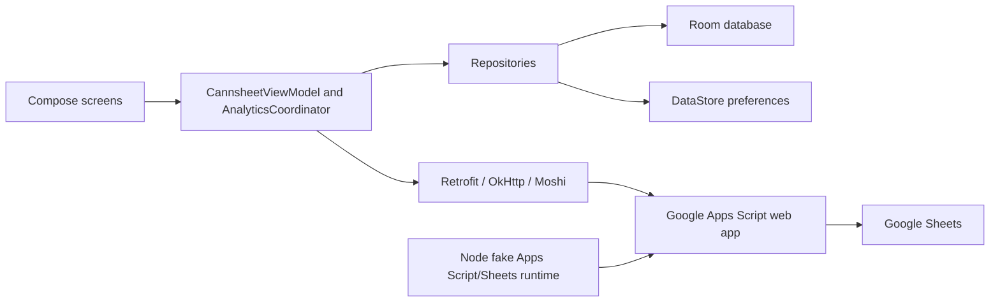
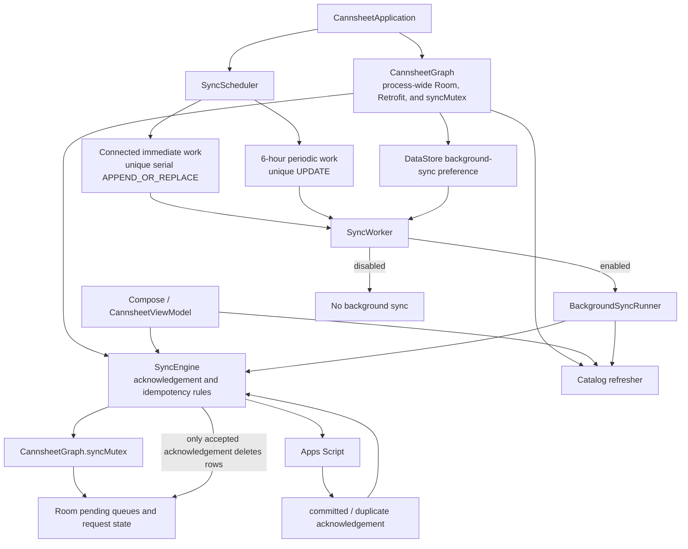

# Architecture

## System overview

Cannsheet Mobile is a single-module Android client backed by a Google Apps
Script web app and Google Sheets. The Android client is local-first for
user-created purchase, consumption, and finish actions: Room holds pending work
until the client acknowledgement logic accepts a compatible backend response.


```mermaid
flowchart LR
    UI["Compose screens"] --> VM["CannsheetViewModel and AnalyticsCoordinator"]
    VM --> Repo["Repositories"]
    Repo --> Room["Room database"]
    Repo --> Prefs["DataStore preferences"]
    VM --> HTTP["Retrofit / OkHttp / Moshi"]
    HTTP --> GAS["Google Apps Script web app"]
    GAS --> Sheets["Google Sheets"]
    Tests["Node fake Apps Script/Sheets runtime"] --> GAS
```

## Android components

- `app/src/main/java/com/example/CannsheetApplication.kt` performs process-wide
  dependency initialization and work scheduling. Its `CannsheetGraph` owns the
  one Room database, repositories, preferences, sync engine, catalog refresher,
  and the shared `syncMutex` that serializes every queue synchronization attempt.
- `app/src/main/java/com/example/MainActivity.kt` starts the Compose application.
- `app/src/main/java/com/example/ui/AppNavigation.kt` owns the bottom navigation
  between Log, Purchase, Insights, and Settings.
- The screen files under `app/src/main/java/com/example/ui` render Compose UI
  and delegate operations to `CannsheetViewModel`.
- `app/src/main/java/com/example/ui/CannsheetViewModel.kt` coordinates product
  refresh, the cancellable submission countdown, queue snapshots, network calls,
  environment checks, acknowledgements, and user-visible sync state.
- `app/src/main/java/com/example/ui/AnalyticsState.kt` separates
  Insights/History loading, refresh, pagination, cache fallback, and UI error
  mapping.
- `app/src/main/java/com/example/data/Repository.kt` mediates Room operations
  and coordinates product refresh.
- `app/src/main/java/com/example/data/Database.kt` defines the Room schema, DAO,
  transactions, and migrations. The checked-in schema version is 10, with
  explicit migrations 2-to-3 through 9-to-10.
- `app/src/main/java/com/example/data/Network.kt` defines Apps Script
  request/response DTOs and Retrofit endpoints.
- `app/src/main/java/com/example/data/SyncQueueLogic.kt` decides which immutable
  queue IDs a response safely acknowledges.
- `app/src/main/java/com/example/data/AnalyticsData.kt` defines the versioned
  analytics/history contract, repository, and cache serialization.
- `app/src/main/java/com/example/data/ConsumptionPreferencesRepository.kt`
  stores quick-log presets and the unopened-product preference in DataStore.

### Background queue synchronization

The app schedules safe retry of the existing pending queues without changing
their backend contract. `SyncEngine` is the only component allowed to send a
queue snapshot, and it holds `CannsheetGraph.syncMutex` for the complete
attempt. The foreground view model and the background worker therefore cannot
send competing snapshots from separate Room or Retrofit instances.


```mermaid
flowchart TD
    App["CannsheetApplication"] --> Graph["CannsheetGraph\nprocess-wide Room, Retrofit, and syncMutex"]
    Graph --> Prefs["DataStore background-sync preference"]
    Graph --> Engine["SyncEngine\nacknowledgement and idempotency rules"]
    Graph --> Refresher["Catalog refresher"]
    App --> Scheduler["SyncScheduler"]
    UI["Compose / CannsheetViewModel"] --> Refresher
    UI --> Engine
    Scheduler --> Immediate["Connected immediate work\nunique serial APPEND_OR_REPLACE"]
    Scheduler --> Periodic["6-hour periodic work\nunique UPDATE"]
    Immediate --> Worker["SyncWorker"]
    Periodic --> Worker
    Prefs --> Worker
    Worker -->|enabled| Runner["BackgroundSyncRunner"]
    Worker -->|disabled| Stop["No background sync"]
    Runner --> Engine
    Runner --> Refresher
    Engine --> Mutex["CannsheetGraph.syncMutex"]
    Mutex --> Queue["Room pending queues and request state"]
    Engine --> HTTP["Apps Script"]
    HTTP --> Ack["committed / duplicate acknowledgement"]
    Ack --> Engine
    Engine -->|only accepted acknowledgement deletes rows| Queue
```

`CannsheetApplication` keeps ordinary default WorkManager initialization; the
feature does not use expedited work. The scheduler enqueues connected immediate
work with `APPEND_OR_REPLACE` so requests remain serial, and updates the one
six-hour periodic work request with `UPDATE`. A DataStore preference is a kill
switch: when off, work exits without sending queued actions. It does not delete
queued rows or alter foreground acknowledgement behavior.

## Important data flows

### Product refresh

1. The view model calls the Apps Script GET endpoint.
2. The response environment must match `BuildConfig.APP_ENVIRONMENT`.
3. Network products are mapped to Room entities.
4. A Room transaction replaces server-backed products, restores pending
   purchase products, reapplies queued finish state, and merges newer product
   interaction data. The nullable `totalUses` value is the backend-confirmed
   cumulative quantity from the correction-safe `Purchases.Uses` projection.

### Product usage totals on Log

The ordinary product GET response carries `totalUses` from the existing
`Purchases.Uses` projection. The backend validates that projection as finite and
nonnegative and rounds the response to six decimal places; it does not scan
`ConsumptionEvents` or calculate a second legacy total during catalog refresh.
Android stores the value as nullable `Product.totalUses` so older deployments and
products without a compatible confirmed value remain explicitly unavailable.

The Log screen keeps confirmed and local values separate. A Room query groups
durable, unsynced `consumption_actions` rows by `productId` and exposes their
`uses` sum as `pendingUsesByProduct`. Temporary borrowed-product IDs are remapped
by the existing acknowledgement transaction, so pending values follow the final
product ID. Acknowledgement deletes queue rows; the subsequent product refresh
supplies the new confirmed projection. Pending purchases, finish actions, the
undo countdown, and pending History corrections are not included in this sum.
The selected product card and Recent Products cards display both values when
available; the product picker does not. The app never adds pending values into
`totalUses` locally or presents a combined provisional total.

### Purchase, consumption, finish, and correction synchronization

1. A UI action enters a short cancellation countdown.
2. After confirmation, the action is written to a Room queue with a stable
   action/event UUID. Consumption corrections additionally retain the target
   event UUID, expected correction head, operation, and immutable replacement
   snapshot. Consumption and finish transactions also update local product
   state.
   Version-2 date/time strings represent wall-clock values in
   `CANN.TIME_ZONE`; the backend parses them explicitly in that zone so the
   stored instant cannot change with the Apps Script host or test-runner zone.
3. Synchronization snapshots the pending queues and uses a persisted request ID.
4. The snapshot is posted to Apps Script.
5. The client checks the response environment and request identity.
6. Only items acknowledged with an accepted `committed` or `duplicate` status,
   or covered by the explicit legacy-compatible rule, are deleted locally.
   Corrections require the exact sent action and target event pair.
7. Timeouts and uncertain responses leave the items queued for safe retry.

Background work follows the same flow, including the persisted request ID,
environment and response-identity checks, and acknowledgement-only deletion.
It is a second trigger for the existing idempotent protocol, not a new backend
write path or a second source of truth.

### Insights and History

1. `AnalyticsCoordinator` requests versioned Insights or paginated History data.
2. The backend response must match the expected environment and contract.
3. Valid responses are cached in Room.
4. Cached data can be shown when a refresh fails.
5. History uses cursor pagination and permits a bounded stale-cursor recovery
   rather than mixing incompatible pages.

### Consumption history corrections

The correction protocol keeps the canonical `ConsumptionEvents` rows immutable.
Each edit is a new row in `ConsumptionEventCorrections` with a stable correction
UUID, a target event UUID, the expected current correction head, and one of
three operations:

- `REPLACE` supplies the corrected event snapshot;
- `VOID` removes the event from effective totals without deleting its audit
  history; and
- `RESTORE` makes a voided event effective again.

The backend validates the correction schema/write gate, immutable IDs, target
existence, the expected chain head, replacement values, and product-reopen
safety before accepting a correction. Exact duplicate correction UUIDs are
acknowledged idempotently; reuse of a UUID for different content is rejected.

Analytics and History replay each event's linear correction chain to construct
one effective view. That same resolver serves legacy and current read contracts
so older clients do not calculate different totals. History retains lifecycle
and audit details even when an event is voided. Correction-sheet position is
part of the History snapshot boundary, so a correction made between pages
causes a stale-cursor response instead of mixing two versions of history.

Accepted correction writes participate in the same durable apply journal,
locking, retry, and reconciliation boundaries as other synchronized actions.
Production rollout is additive and disabled-first: provision the schema,
reconcile it, then explicitly enable writes. Sandbox provisioning may enable
the capability only after read-only environment, spreadsheet, form, and Config
identity checks pass.

The Android client enables Correct, Void, and Restore only from a fresh
version-2 History response that advertises the correction capability. It keeps
pending corrections in Room across restarts and retains rejected or uncertain
items for review or retry. Paginated History displays lifecycle and revision
metadata but does not request every audit revision; the complete append-only
audit remains available at the backend boundary until a bounded single-event
detail contract is introduced.

## Persistence and models

Room contains tables for products, purchase actions, consumption actions, finish
actions, consumption corrections, product interactions, sync request state, and
analytics cache entries. `products.totalUses` was added by the forward 9-to-10
migration and is nullable. The `consumption_actions` aggregate is a live view of
the pending queue only, not a replacement for server history. DataStore holds
user preferences that do not require relational transactions.

Room and the pending queues are user-data boundaries. Migrations must be
forward-only and tested; destructive fallback is not an acceptable shortcut.
Stable IDs and acknowledgement semantics must be preserved.

## Backend and external integrations

- `backend_additions.gs` is the Apps Script web-app implementation.
- `appsscript.json` enables the Advanced Sheets service, uses the V8 runtime,
  executes as the deploying user, and declares anonymous web-app access.
- No user authentication flow is present in the checked-in Android source. The
  client contract instead uses the configured endpoint, environment identifier,
  request IDs, immutable action/event IDs, response validation, and backend
  spreadsheet rules.
- Production and sandbox endpoints/build environments must remain isolated.
- Apps Script reads and writes the connected Google Sheets workbook. Backend
  changes must account for locking, retries, partial writes, duplicate delivery,
  reconciliation, and trigger behavior.
- Consumption corrections are append-only. Code must not rewrite or delete the
  original consumption event to simulate an edit.
- `CONSUMPTION_CORRECTION_SCHEMA_VERSION` and
  `CONSUMPTION_CORRECTION_WRITES_ENABLED` are independent rollout gates.

## State and error handling

Compose observes `StateFlow`/Flow state from the view model, analytics
coordinator, Room, and DataStore. Network and contract failures are translated
into user-visible status/error state. Pending work remains local when the server
cannot prove a safe acknowledgement. Analytics can fall back to cached data;
data-quality warnings remain explicit rather than silently normalizing unknown
source values.

## Testing approach

- `app/src/test`: JVM unit tests for UI helpers/coordinators, environment
  contracts, queue acknowledgement logic, preferences, filtering, product
  mapping, usage formatting, and status handling.
- `app/src/androidTest`: Room migration/queue tests and Compose UI tests that
  require a device or emulator, including pending-usage aggregation, the 9-to-10
  migration, and selected/recent usage-total rendering.
- `tests`: Node scripts execute the checked-in Apps Script source against fake
  Apps Script/Sheets implementations; a Python unittest covers deterministic
  backend benchmark tooling.
- `.github/workflows/android-pr-checks.yml`: Android unit tests, backend
  analytics tests, and a debug build for pull requests to `main`.

Tests that use fake runtimes do not prove the current state of a live Apps
Script deployment or spreadsheet.

## Build, deployment, and distribution

The default debug/release variants use the production endpoint and environment
values from `app/build.gradle.kts`; the sandbox variant uses an application ID
suffix and an untracked `sandbox.properties` endpoint. Release signing is
configured only when all required signing environment variables are present.

Pull requests target `main`. Tag pushes matching `v*` trigger the release
workflow, which validates the tag/version match, runs tests/lint, builds and
verifies a signed APK, creates a checksum, and publishes to a separate release
repository. That workflow is an explicit release operation, not ordinary
validation.

## Architectural boundaries

- UI code should not directly mutate Room or spreadsheet data.
- Repository/database operations own local persistence and transaction safety.
- Network DTOs and environment checks form a compatibility boundary.
- Pending queue rows are removed only through the acknowledgement rules.
- `SyncEngine`, protected by `CannsheetGraph.syncMutex`, is the sole queue
  synchronization boundary for foreground and WorkManager-triggered attempts.
- Android source, Apps Script source, live deployment state, spreadsheet state,
  CI state, and published APK state are separate evidence boundaries.

## Directory map

```text
app/src/main/                 Android production source and resources
app/src/sandbox/              Sandbox-specific resources
app/src/test/                 Local JVM tests
app/src/androidTest/          Device/emulator and Room migration tests
tests/                        Backend fake runtime and regression scripts
.github/workflows/            Pull-request and release automation
performance_evidence/         Checked-in backend performance evidence
docs/                         Shared project context and latest handoff
backend_additions.gs          Google Apps Script backend
appsscript.json               Apps Script manifest
```
